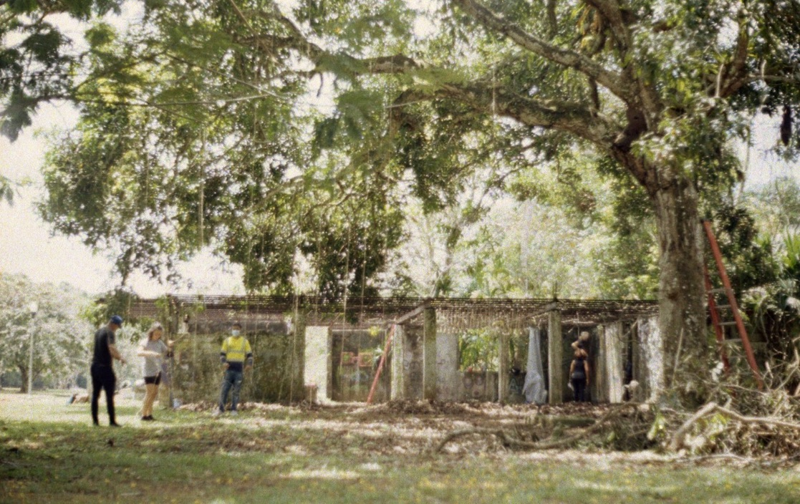

<ul class="article-list content-width content-offset">
    <li class="article-list__title-block">
        

            <h2>concept</h2>
        

        

            

                What does it mean to live in a world that is both highly technological and richly natural? What is the aesthetic relationship between the material and the ecological? And how do we as human beings make sense of our own ephemerality?  
                Glyph.land is a multimedia art piece created in May 2021 for Your Art Aqui in Gamboa, Panama. With the permission of the town, 8 artworks were installed in an abandoned structure, each interacting with the local ecology and exploring the idea of ephemerality. My piece investigated a series of large graphic symbols which were stationed at various points in the town, which I called glyphs.
            

        

    </li>
    <li class="article-list__title-block">
        

            <h2>Glyph Land</h2>
        

        

            

                In the exhibition space, the viewer encounters a hanging artifact with a QR code printed on it. Upon interacting with the code, they are brought to a web page with a poem and a series of photographs of the glyphs overlayed with lime green polygons.
            

        

    </li>
    <li class="article-list__title-block">
        

            <h2>Interpretation</h2>
        

        

            

                The town of Gamboa is defined by its historical connection to the Canal and the lush ecology that surrounds it. While walking around a nearby nature reserve, I discovered large graphic symbols, the size of billboards, carved out of the jungle. Locals explained that they served to help ships navigate the Canal. Standing next to them, I felt wedged between worlds: the simplified, gargantuan and graphic language of computer-aided cargo navigation; the detailed, formless, ancient energy of the jungle.   
                I began to interpret this divide as temporal; the jungle representing humanity’s distant past, the glyphs representing our technological present. What is ephemeral in this equation is us.
            

        

    </li>
    <li class="article-list__title-block">
        

            <h2>Learnings</h2>
        

        

            

                This was an extremely challenging piece for me to create. I experienced great discomfort investigating this juxtaposition of wild nature and cold technological symbology. The image collapses all space, yet the screen collapses intention. By framing these glyphs against the backdrop of nature
            

        

    </li>
</ul>