

    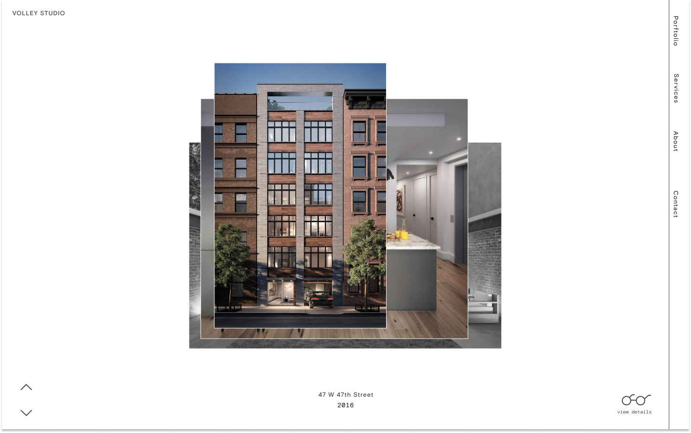

<ul class="article-list content-width content-offset">
    <li class="home__title-block">
        

            

                Brooklyn-based Volley Studio specializes in high-quality 3D renderings for architects and developers. I created a new website that displays Volly’s work in an unconventional and memorable way.            
            

        

        

            <h2>About</h2>
        

    </li>
    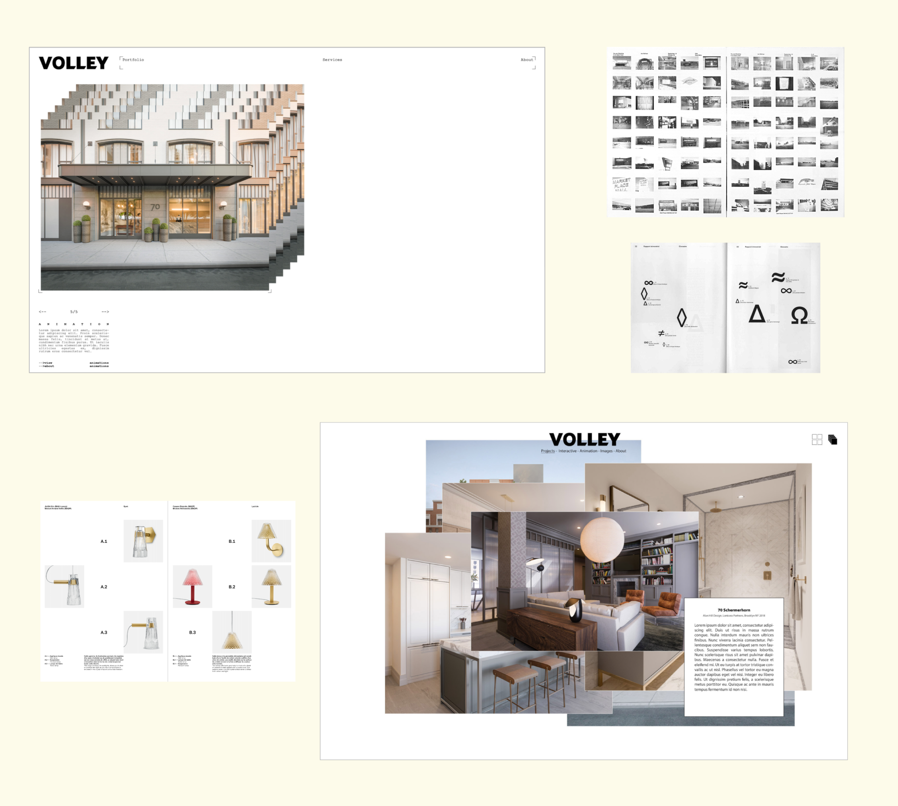
    <li class="home__title-block">
        

            

                We were interested in presenting Volley’s work as a series of overlapping images that could be moved around the screen freely. After a handful of rounds of design, prototyping, and feedback, we evolved this concept to be more simple and less demanding of the user.            
            

        

        

            <h2>Process</h2>
        

    </li>
</ul>

    <video style="height: 100%;" src="https://stream.mux.com/DLHZ02CVJtWLxjqZcDJlffJkNk8a3cUcaB3sNMtfZBFY.m3u8" autoplay loop ></video>

<ul class="article-list content-width content-offset">
    <li class="home__title-block">
        

            

                We were interested in presenting Volley’s work as a series of overlapping images that could be moved around the screen freely. After a handful of rounds of design, prototyping, and feedback, we evolved this concept to be more simple and less demanding of the user.            
            

        

        

            <h2>Concept</h2>
        

    </li>
</ul>

    <h2>Screens</h2>
    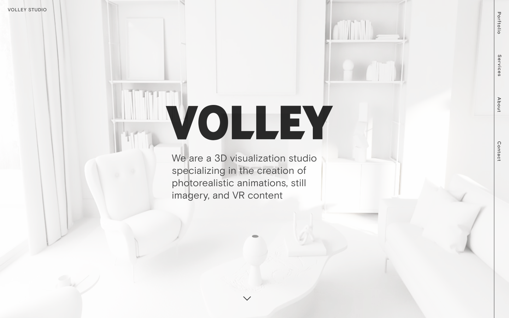
    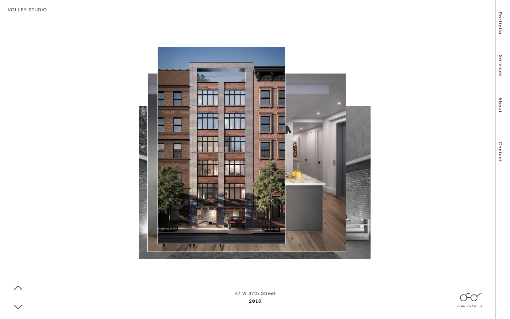
    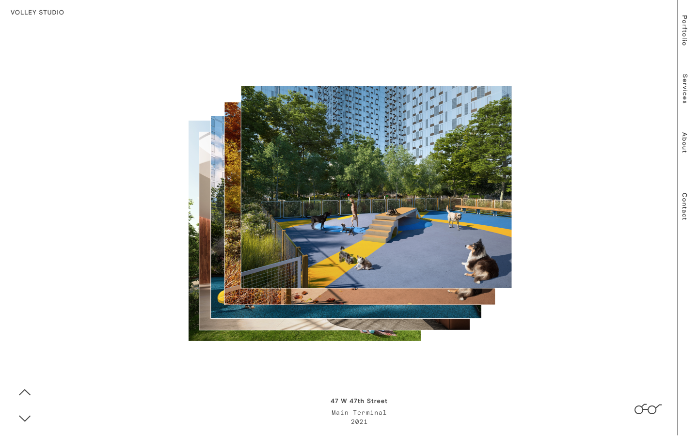
    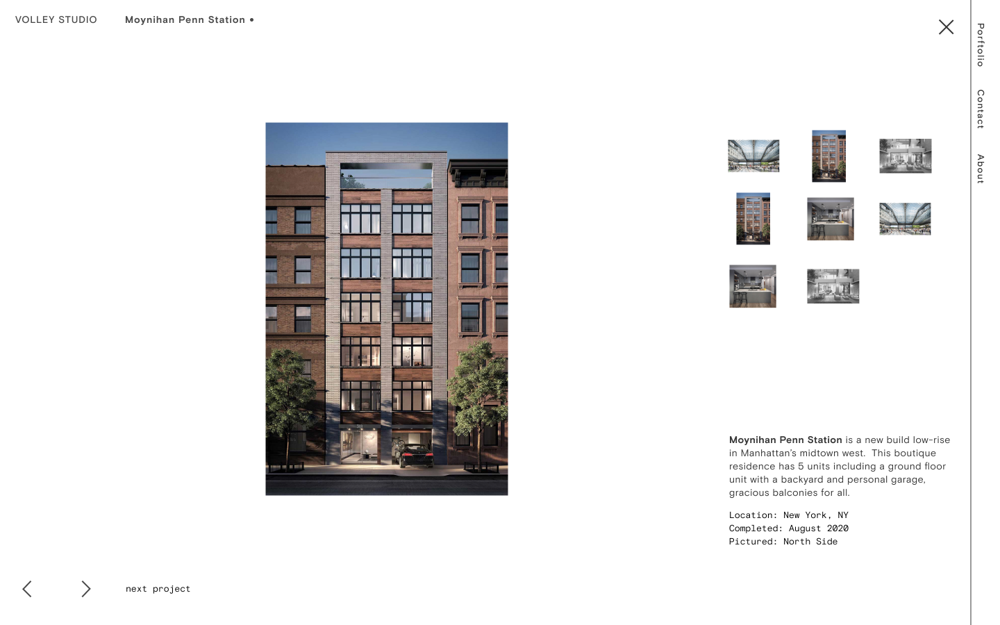
    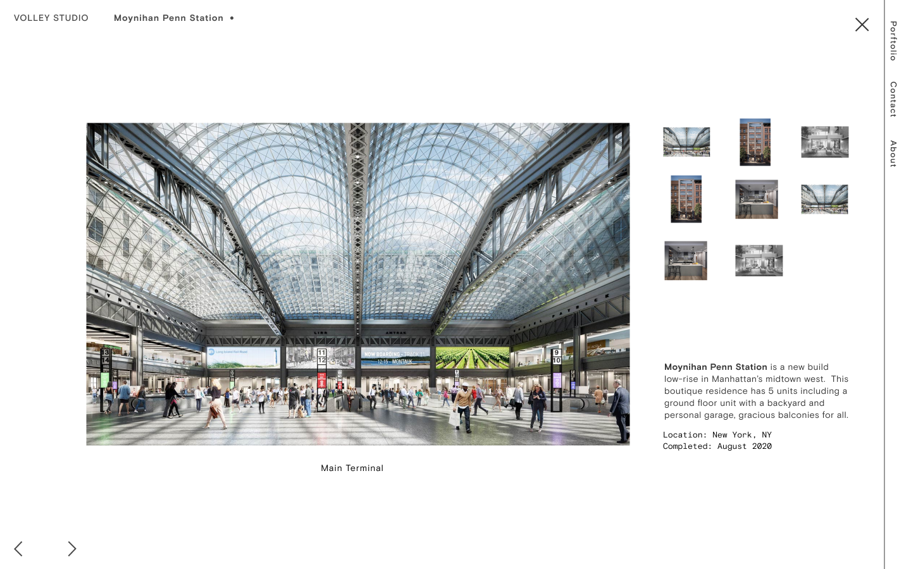
    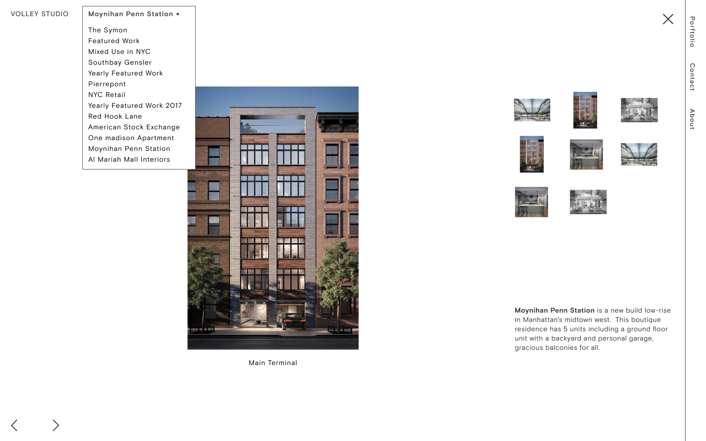
    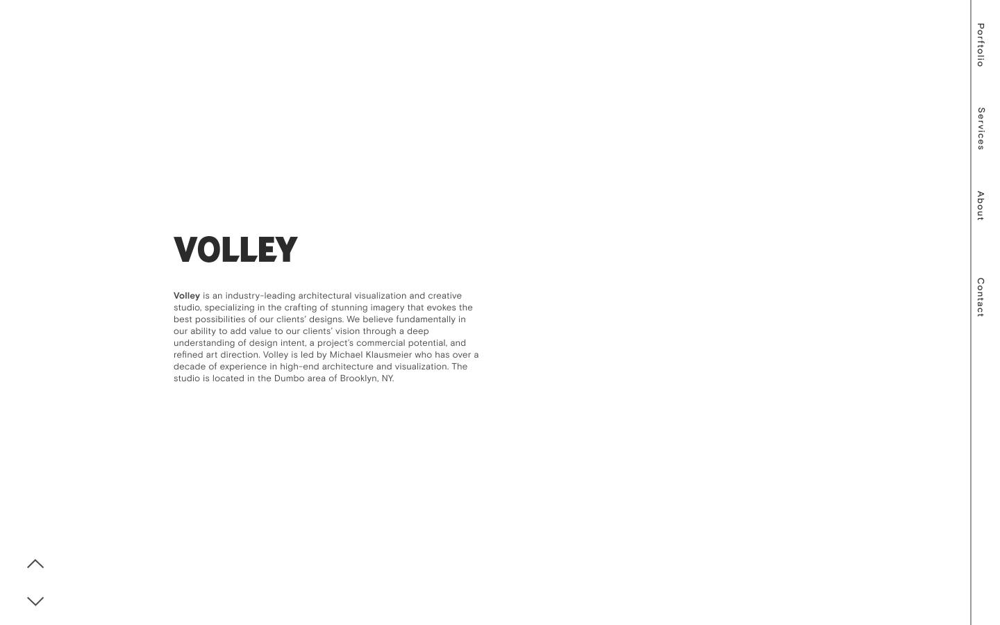
    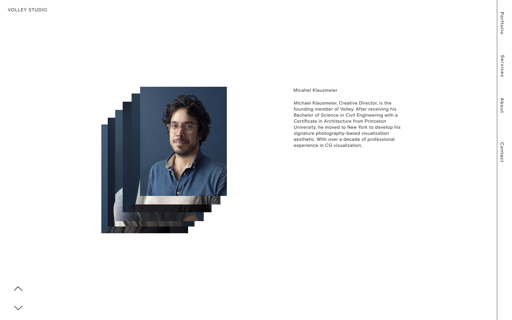
    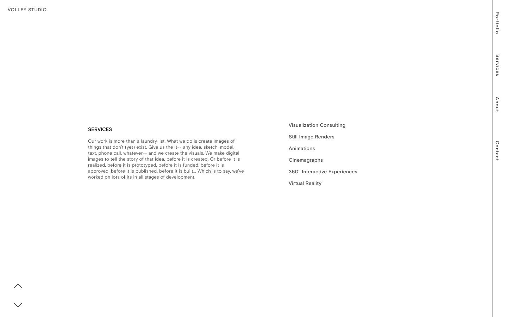
    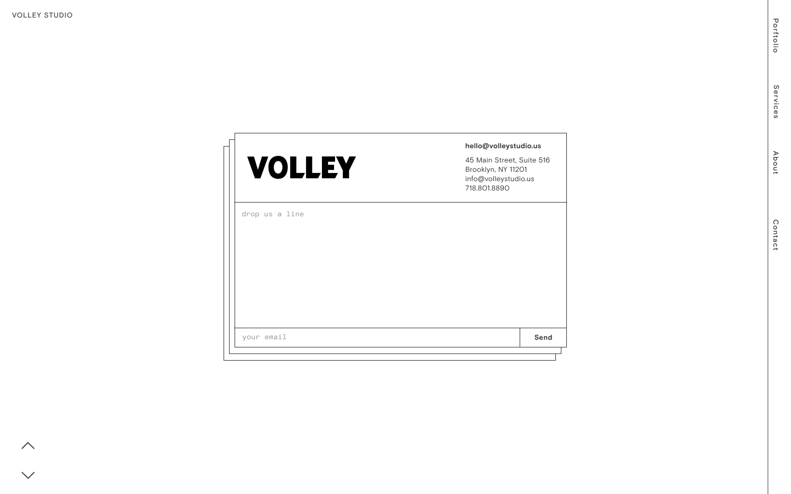
    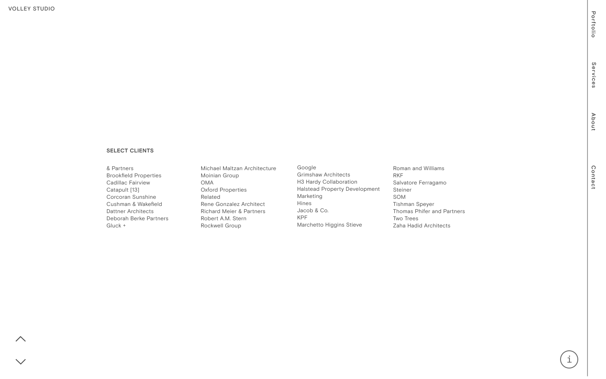

