

    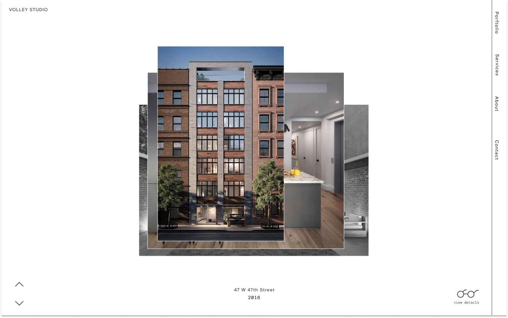

<ul class="article-list content-width content-offset">
    <li class="article-list__title-block">
        

            <h2>About</h2>
        

        

            

                I created a portfolio site for Volley, a Brooklyn-based studio specializing in high-quality 3D renderings for architects and developers.
            

        

    </li>
    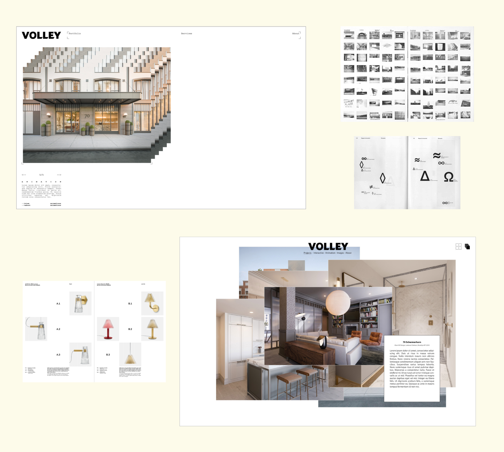
    <li class="article-list__title-block">
        

            <h2>Concept</h2>
        

        

            

                We were interested in presenting Volley’s work as a series of overlapping images that could be moved around the screen freely. After a handful of rounds of design, prototyping, and feedback, we landed on a a simpler design in which images shuffle like a stack of cards.
            

        

    </li>
</ul>

    <video
        poster="images/volley/volley-stack-poster.png"
        style="max-height: 30em;"
        autoplay muted loop
    >
        <source src="https://stream.mux.com/DLHZ02CVJtWLxjqZcDJlffJkNk8a3cUcaB3sNMtfZBFY.m3u8" type="video/mp4"></source>
    </video>

<ul class="article-list content-width content-offset">
    <li class="article-list__title-block">
        

            

                In addition to using the stack concept throughout, the site is full of fun details, from the custom scroll bar to the light/dark mode button on the bottom right of the screen.
            

        

        

            <h2>Design</h2>
        

    </li>
</ul>

    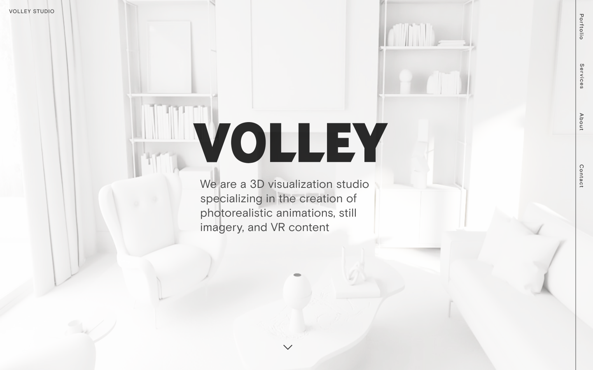
    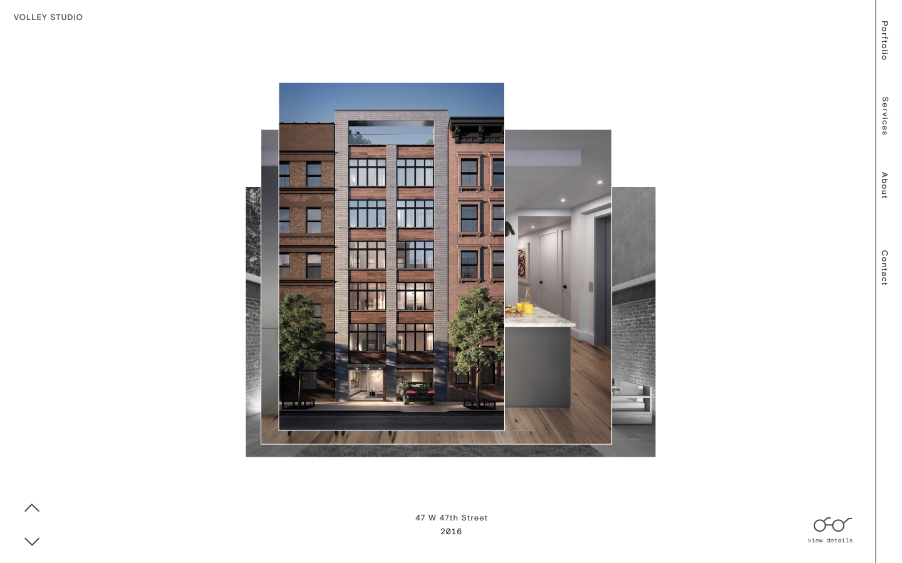
    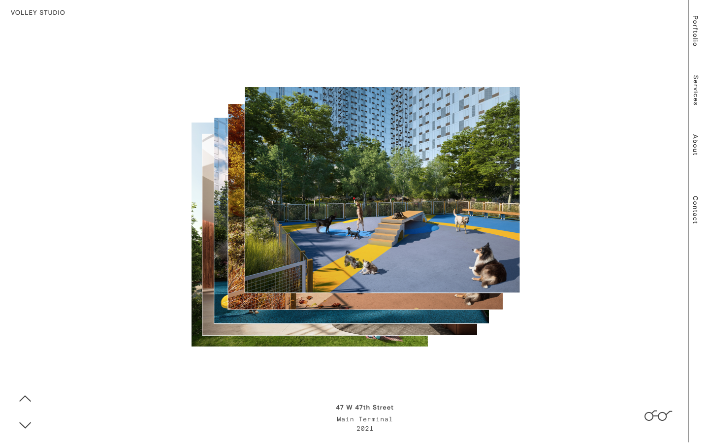
    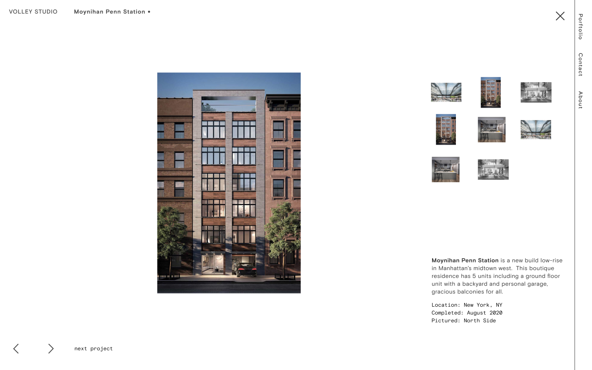
    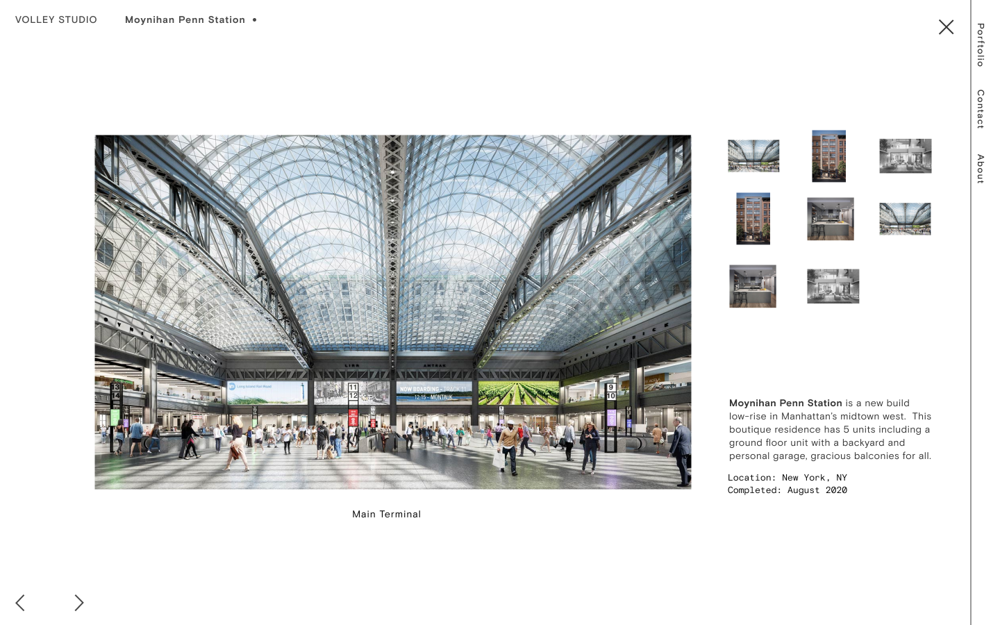
    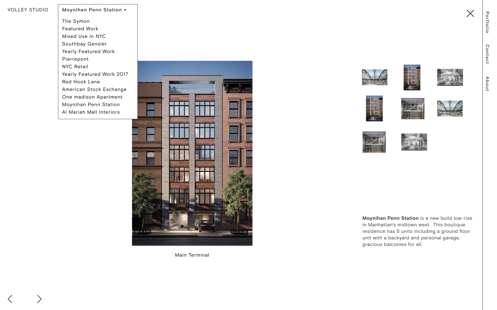
    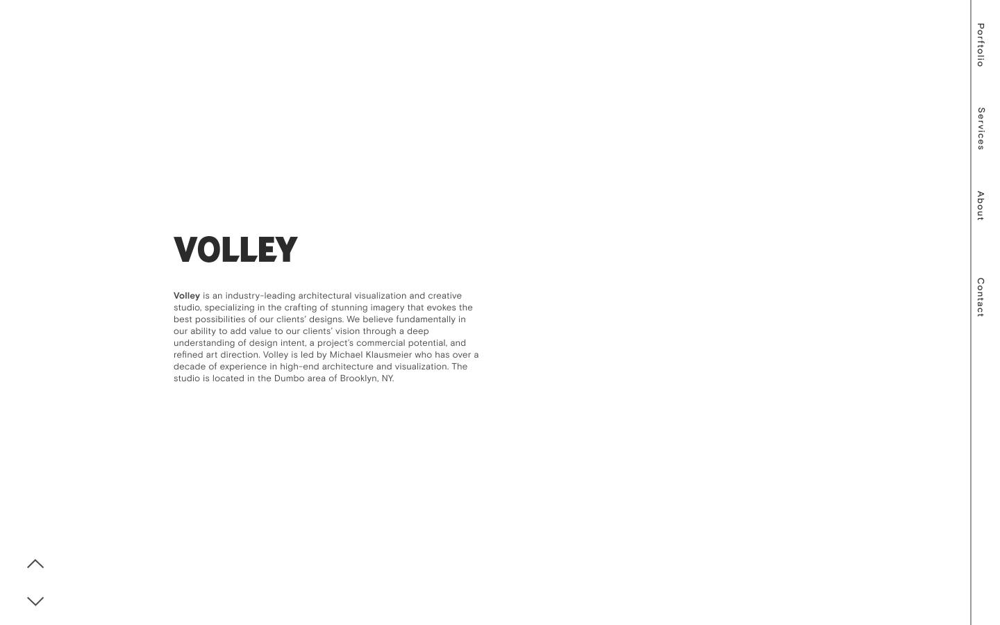
    
    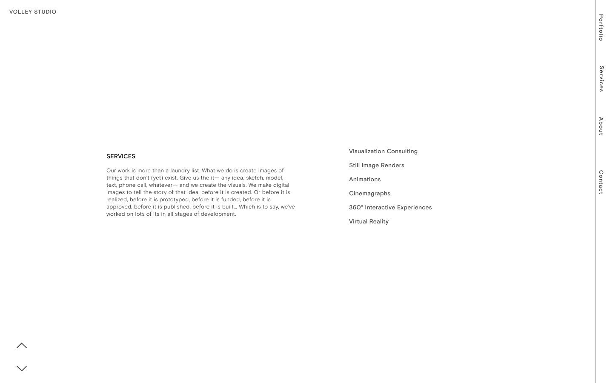
    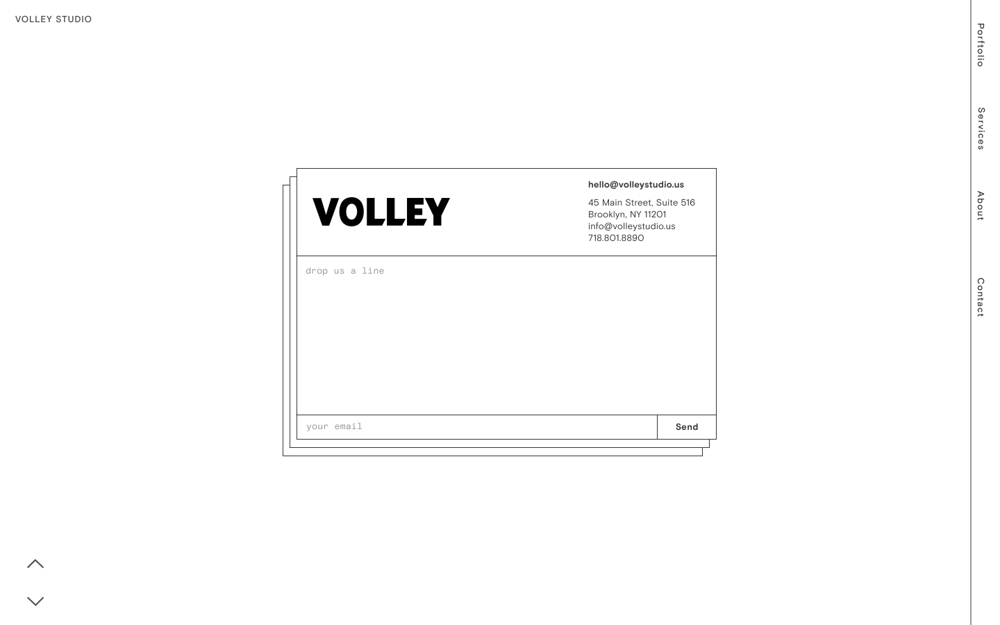
    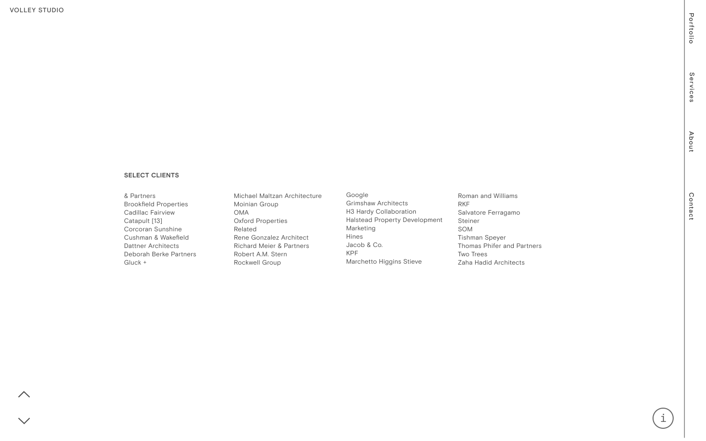

