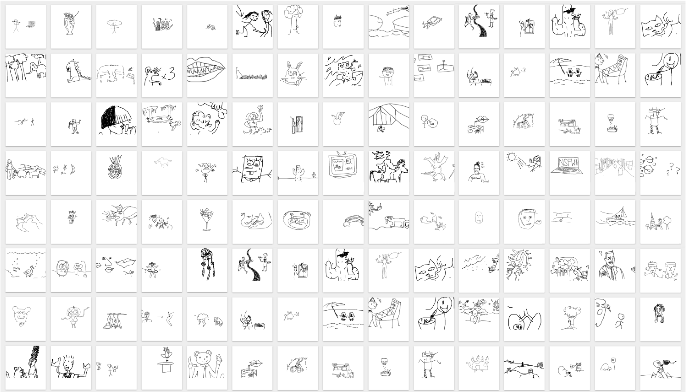
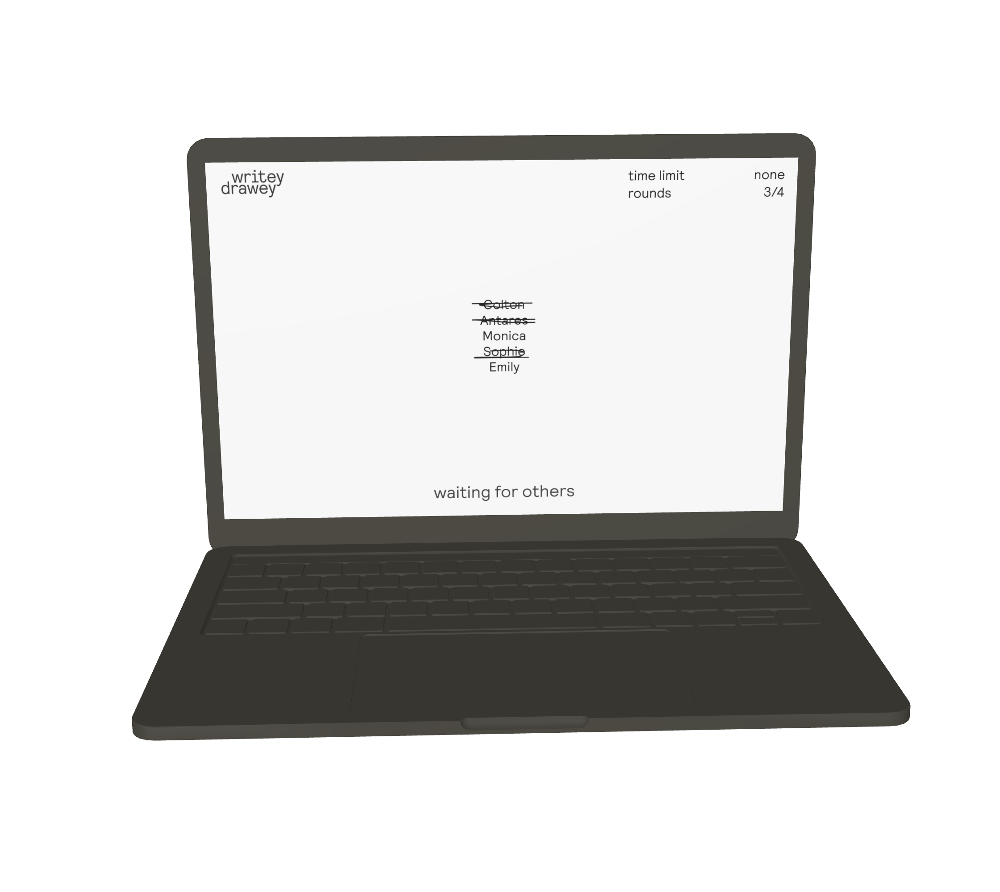

<ul class="article-list content-width content-offset">
    <li class="home__title-block">
        

            

                What would happen if the scale of the internet was used to multiply creativity? Writey Drawey is an interactive web game that invites players to draw together. The rules of the game are simple: each person chooses a word or phrase, and players take turns illustrating the words, describing the drawings, etc. The translations happen back and forth until the circle is complete and the original meaning has been mutated, often to comedic effect.
            

        

        

            <h2>concept</h2>
        

    </li>
    <li class="home__title-block">
        

            

                The site was first created as a live, functional prototype without much style. Because the goal was to re-create a game which could easily be played with pen and paper,  style in the first version felt appropriate. I was curious to explore how plain HTML & CSS might represent the internet version of simple, available physical materials.
            

        

        

            <h2>execution</h2>
        

    </li>
</ul>

    

<ul class="article-list content-width">
    <li class="home__title-block">
        

            

                After the basic prototype launched, to my surprise a lot of people played the game and liked it. Soon a natural aesthetic direction emerged which was informed by the character of the drawings people were making. The contraints of the platform — like having to use a mouse to draw — and the rules of the game itself were leading to a particular drawing style that I liked. Additionally, simple usability improvements were made, like maximizing screen real estate for game functions and choosing a responsive-compatible layout.    
            

        

    </li>
</ul>

    

<ul class="article-list content-width">
    <li class="home__title-block">
        

            

                As a design object, Writey Drawey provides a unique lens into a limits of digital interaction where incoherence is the intended outcome. In other words, most of our digital interaction
            

        

        

            <h2>learnings</h2>
        

    </li>
</ul>
