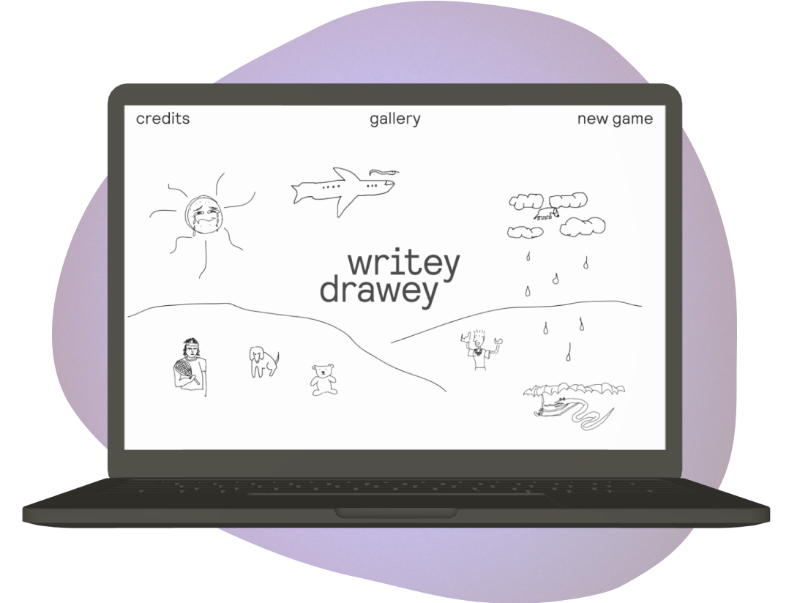
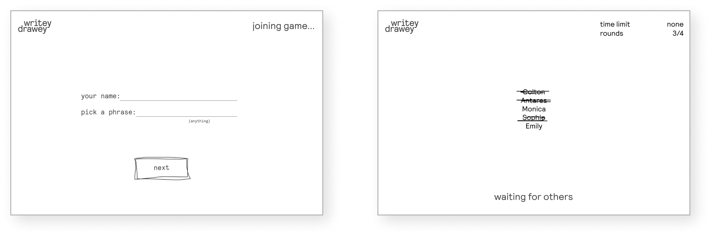
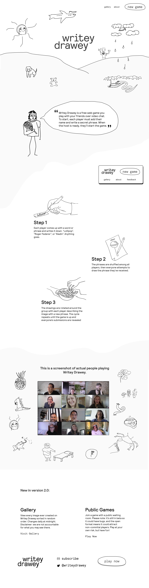
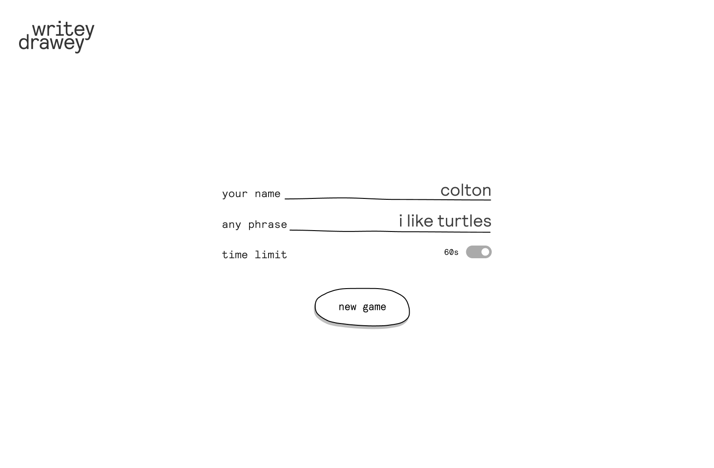
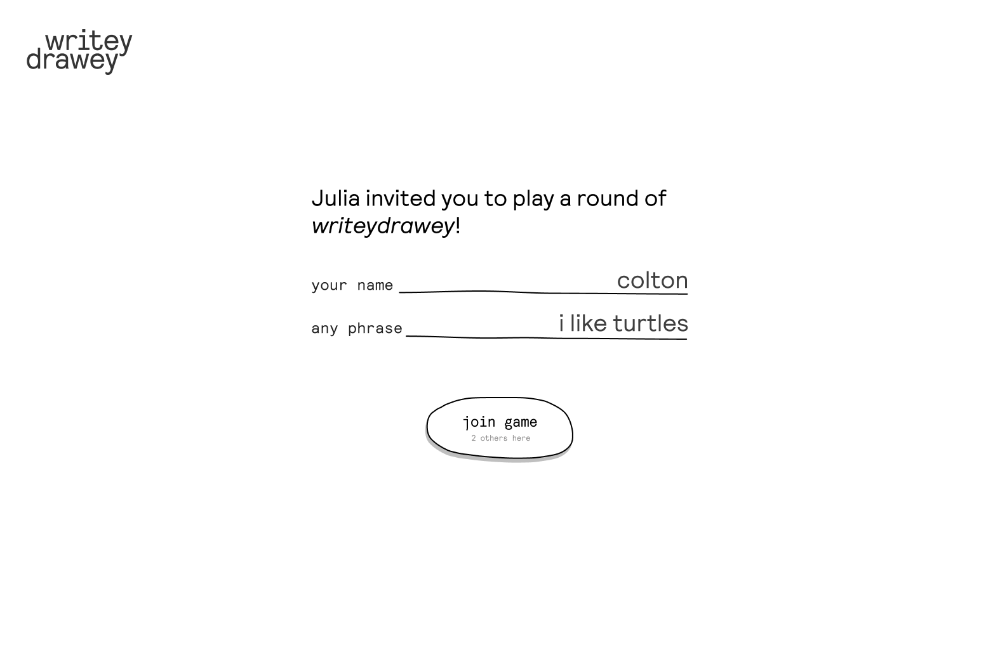
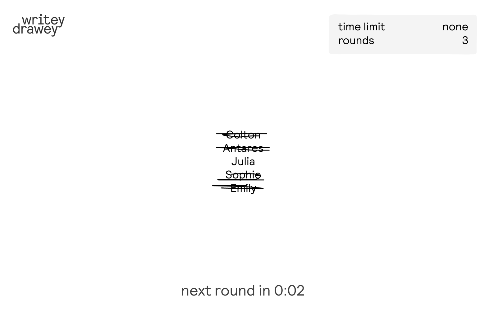
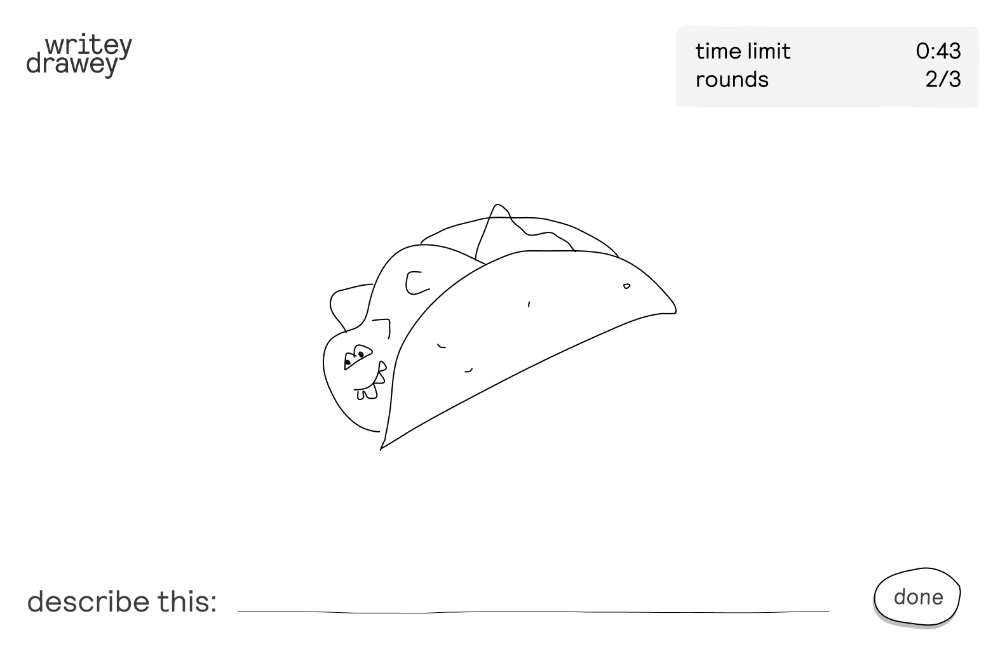
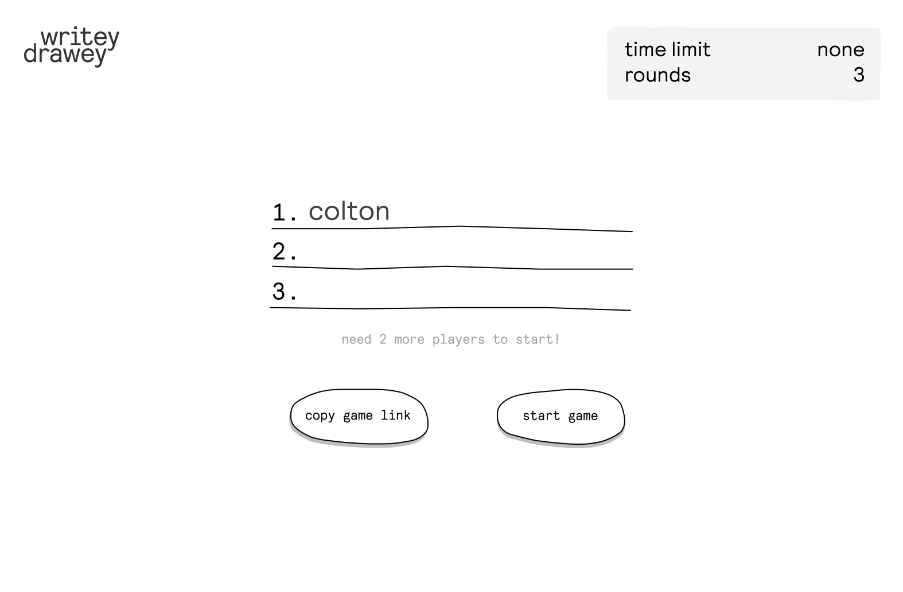
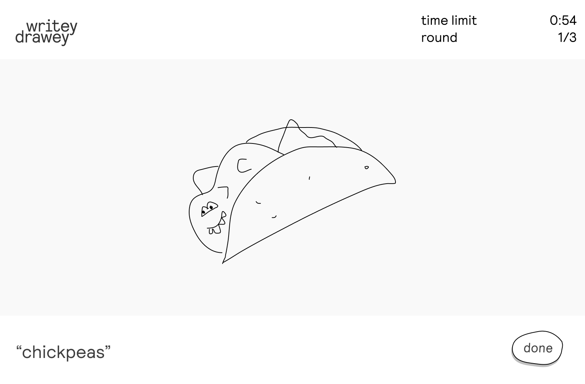
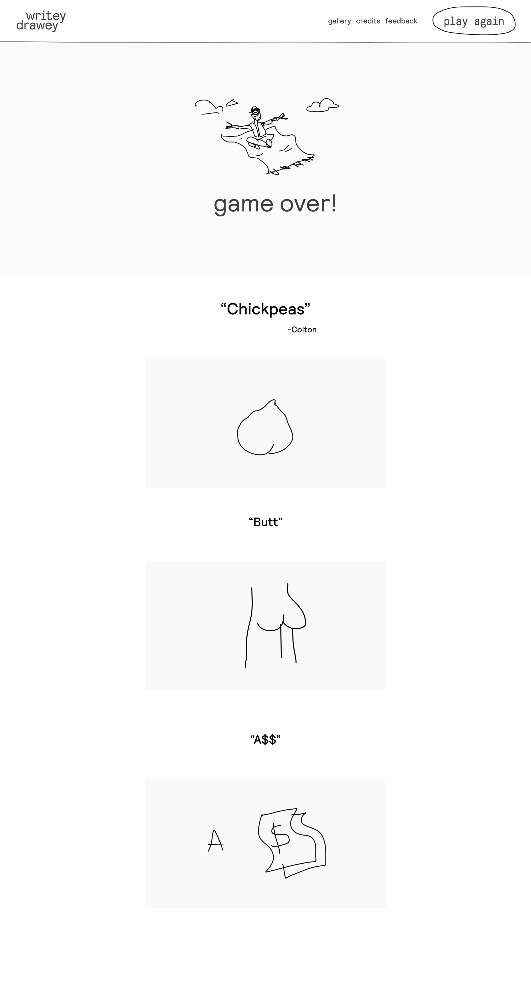

    

<ul class="article-list content-width content-offset">
    <li class="article-list__title-block">
        

            <h2>concept</h2>
        

        

            

                 Writey Drawey is an interactive web game that invites players to draw together. It is based off of a common pen-and-paper game called <u><a target="_blank" href="https://en.wikipedia.org/wiki/Telestrations">Telestrations</a></u>. The rules of the game are simple: each person chooses a word or phrase, and players take turns illustrating the words, describing the drawings, and so on. The translations happen back and forth until the circle is complete and the original meaning has been mutated, often to comedic effect.
            

        

    </li>
    <li class="article-list__title-block">
        

            <h2>execution</h2>
        

        

            

                The site was first created as a simple live, functional prototype. Because the goal was to re-create a game which could easily be played with simple materials, I was curious to explore how plain HTML & CSS might be sufficient for the first version.
            

        

    </li>
</ul>

    

<ul class="article-list content-width">
    <li class="article-list__title-block">
        

            

                After the basic prototype launched, a fair amount of people played the game and liked it. Soon a natural aesthetic direction emerged which was informed by the character of the drawings people were making. The contraints of the platform — like having to use a mouse to draw — and the rules of the game itself were leading to a particular drawing style that I liked. Additionally, simple usability improvements were made, like maximizing screen real estate for game functions and choosing a responsive-compatible layout.    
            

        

    </li>
</ul>

<ul class="article-list content-width">
    <li class="article-list__title-block">
        

            

                As a design object, Writey Drawey provides a space for connection to happen through creativity. This project gave me the insight that people are eager to express themselves online and that with the right intention, the internet can be a vehicle for community.  
                Read more on <a target="_blank" href="https://blog.coltonbrown.com/the-game-that-almost-died-during-covid-and-how-i-made-it-an-app-fa485eed546e">medium.com</a>
            

        

        

            <h2>learnings</h2>
        

    </li>
</ul>

    
    
    
    
    
    
    
    

