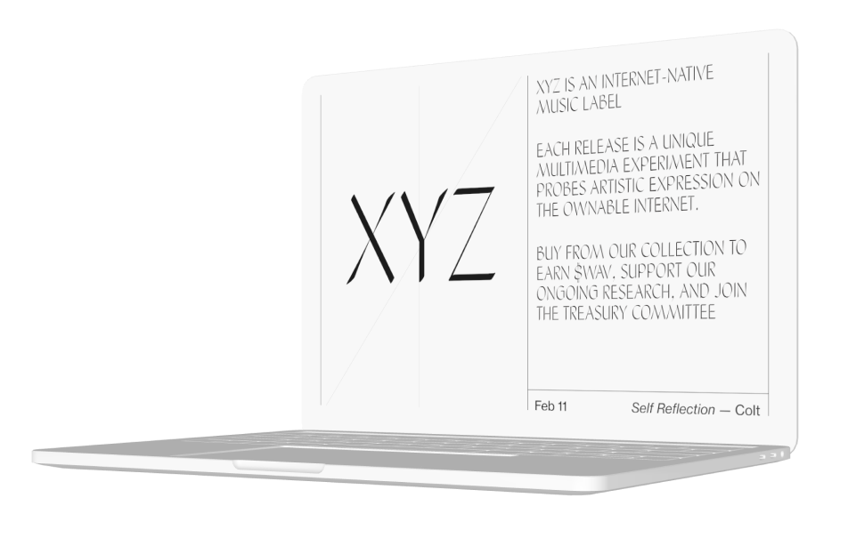
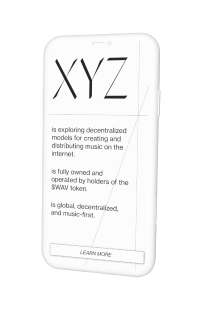

<ul class="article-list content-width content-offset">
    <li class="home__title-block">
        

            

                What if we leveraged web3 tech to support independent music? “XYZ” is a project designed to facilitate ownership, transparency, and shared incentive for music communities. It takes on many of the roles of a music label where community members are co-owners in the cultural output they create.
            

        

        

            <h2>concept</h2>
        

    </li>
</ul>

    
    

 
<ul class="article-list content-width content-offset">
    <li class="home__title-block">
        

            

                To investigate this use case, I built a crypto-native music distribution platform. I raised funds through a mirror crowdfund, started a gated discord server, distributed tokens to community members and shipped a web platform to sell music NFTs with a custom contract to distribute a configurable portion of NFT proceeds to the DAO.
                I developed a brand identity and web design that positiond itself within the design langauge of web3.
            

        

        

            <h2>design</h2>
        

    </li>
</ul>

    XYZ is tokenized via $WAV. That means that holders of $WAV can use it to vote on initiatives or exchange it for ETH. The overall demand of $WAV tokens informs the valuation of the organization, and the supply is set internally.

    The primary purpose of XYZ is to release new music. Initially the DAO invests funds from its treasury to cover production costs for the release, including recording, engineering, artwork, and artist advances. As a reward for participating in each release, $WAV tokens are minted and issued to DAO members, giving them added voting power and increased ownership. The music is finally sold as an NFT, with proceeds split between the artists and the DAO treasury. 

<ul class="article-list content-width content-offset">
    <li class="home__title-block">
        

            

                The project raised public funding on October 28th 2021, launched on February 11th with its first release, and eventually wound-down on April 1, 2021 after I decided the project was not sustainable. 
            

        

        

            <h2>timeline</h2>
        

    </li>
    <li class="home__title-block">
        

            

                The rise of the internet brought with it the fall of traditional record sales, with major labels scrambling to recooperate profits lost from piracy throughout the 90s and 00s. In the decades since, streaming has slowly grown into an economicallty viable alternative, with industry profits recently returning to their pre-internet numbers.
                However, independent labels and artists — left out of the lucrative co-ownership deals enjoyed between major labels and large streaming companies —  have shared a different relationship with the rise of the internet and streaming. During the 00s and 10s, internet forums and blogs gave rise to a splintering of new subgenres and communities. In the creative void of mainstream 2000s radio, independent college radio emerged, bringing a new sound to rock music. Advances in recording technology meant more DIY music. Platforms like Soundcloud and Bandcamp broke new independent artists and supercharged the evolution of new sounds in electronic, ambient, hiphop, and experimental — all without major label promotion or distribution.
                While the internet brought challenges to incumbent music giants, it opened new doors for independents. Today, the internet has grown into a mass-market ecosystem based on economies of scale that makes less economic sense for independent and experimental music. XYZ is an attempt at a new financial model that could be funded with a mix of philanthropic support and fan engagement.
            

        

        

            <h2>backstory</h2>
        

    </li>
</ul>

    

