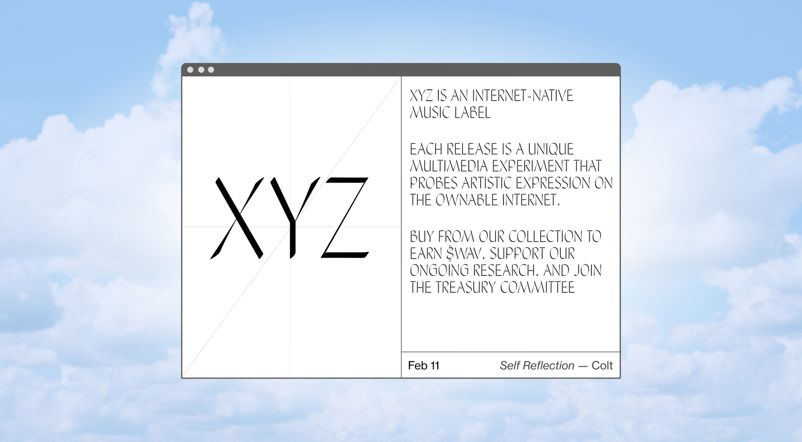
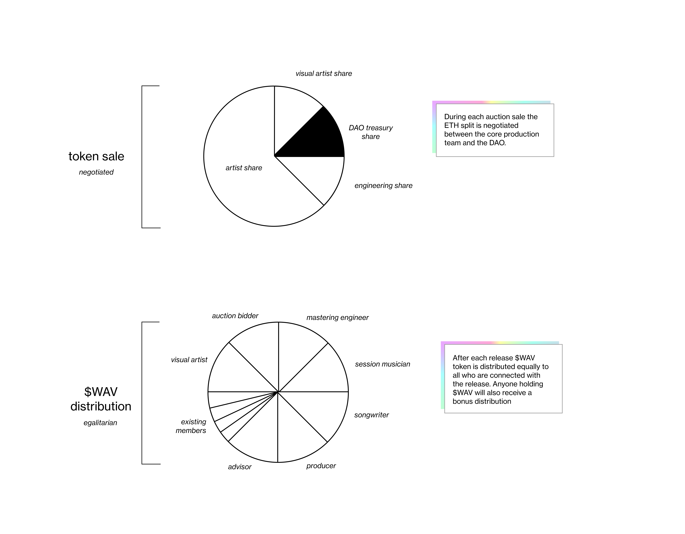

    

<ul class="article-list content-width content-offset">
    <li class="article-list__title-block">
        

            

                “XYZ” aimed to channel cryptocurrency wealth into supporting independent music. Its strategy was to pre-sell supporter tokens and use the profits to pay for up-front production costs. It would then recoup its investments when the work was released and sold on digital asset marketplaces such as Sound, Catalog, or on the native XYZ platform.
            

        

        

            <h2>concept</h2>
        

    </li>
</ul>

<ul class="article-list content-width content-offset">
    <li class="article-list__title-block">
        

            

                XYZ is <i>tokenized</i> via $WAV, which means that holders of $WAV collectively own the project and can can use their shares to vote on initiatives, or exchange it for ETH. The overall demand of $WAV tokens informs the valuation of the organization, and the supply is set internally. <u><a href="https://www.paradigm.xyz/2021/06/creators-communities-and-crypto-part-ii" target="_blank">More on social tokens</a></u>
                 
                 
                The primary purpose of XYZ is to release new music. As a reward for participating in each release, $WAV tokens are minted and issued to DAO members, giving them added voting power and increased ownership.
            

        

        

            <h2>token design</h2>
        

    </li>
</ul>

    

   

<ul class="article-list content-width content-offset">
    <li class="article-list__title-block">
        

            

                The project raised public funding on October 28th 2021, launched on February 11th with its first release, and eventually wound-down on April 1, 2021 after I decided the project was not financially sustainable. 
            

        

        

            <h2>timeline</h2>
        

    </li>
    <li class="article-list__title-block">
        

            <h2>Motivations</h2>
        

        

            

                In the decades since the arrival of the internet, streaming has grown into an economicallty viable alternative to physical record sales, with industry profits recently returning to their pre-internet numbers. However, independent labels and artists were largely left out of the lucrative co-ownership deals enjoyed between major labels and large streaming companies, and they've shared a different relationship with the rise of the internet and streaming.
                While the web 2.0 brought challenges to incumbent music giants, it opened new doors for independents.   Today, the internet has grown into a mass-market ecosystem based on economies of scale that makes less economic sense for independent music and is back to being tailored towards mass market appeal. XYZ is an attempt at founding a new financial model that could make independent music possible in web 3.0.
            

        

    </li>
</ul>

    

    

