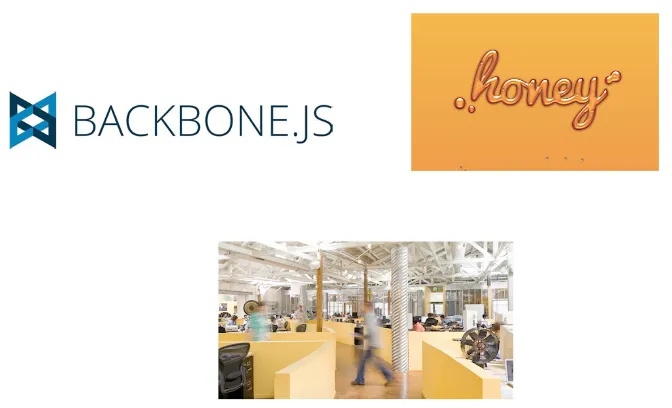
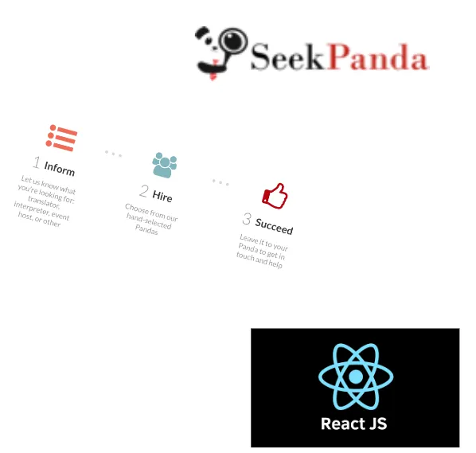
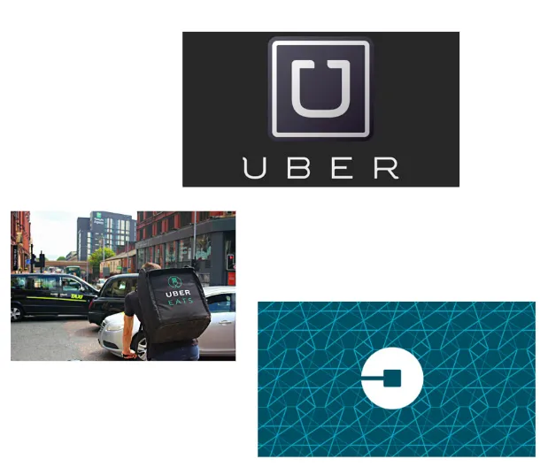
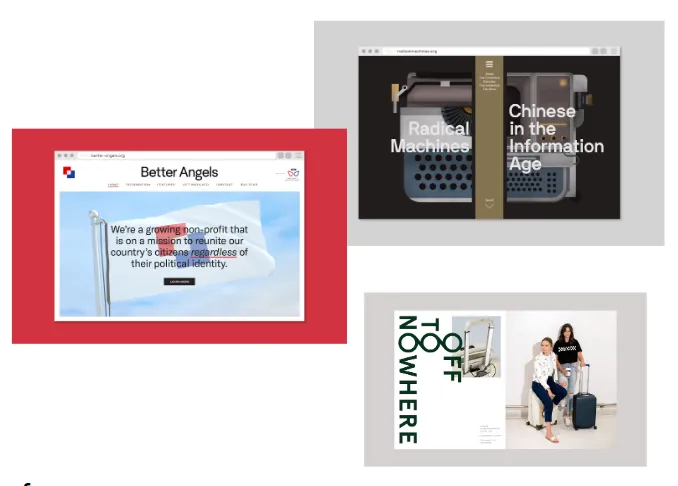
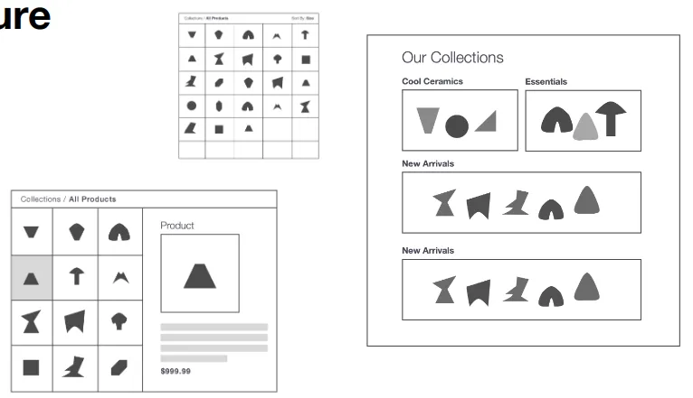
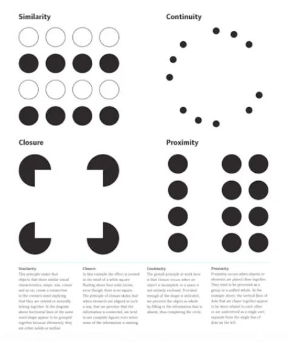
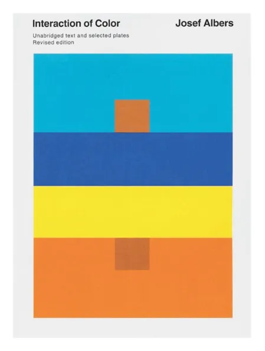
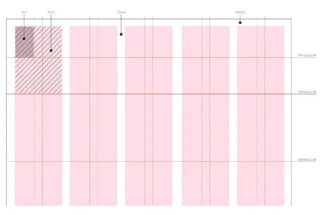

**Speaking the language of our counterparts**

**w/ Colton Brown**

03.30.21

## 🌞  Goals for this talk
1. Share experiences working with engineers
1. Facilitate dialogue around the topic of design in the workplace
1. Help you build better teams and products

## 🌐  Guiding Questions
1. What do engineers and designers get wrong when they perceive each other's roles?
1. How can we use the fundamentals of design to educate our peers to think more like us?
1. What can we learn from the engineers that can improve our design processes?

me

### 🏃‍♂️  growing up & school

1. Tried architecture
1. Started studying physics undergrad
1. Pivoted to computer science because I could make stuff
   
I used to make things as a kid - rockets, guitar effects, skateboards, toys, videos. I took a pre-college course in architecture and though I loved it, I was advised against joining the field and felt uncomfortable with the unbounded creativity. I ultimately studied physics because I wanted to know how the world worked. When I realized that at the most micro level of physics, no one knows anything, I defected to computer science and resolved to learn to make things instead.

Design isn't considered a traditional educational path, and digital product design isn't even on the radar for many kids. Established tracks like architecture are not inviting industries.

**design as:**
+ abstract and arbitrary
+ not scientific
+ “just” art
  

### 🍯  Honey – c. 2013

1. Joined as a newb JS developer
1. We didn’t really know how to approach design
1. Early success hinged on good product / market fit
   
Some founders view design as a resource and not a process. Approaching our startup with a knowledge of the design process might have simplified a lot of early operations at Honey

**design as:**
- purely visual
- a luxury

I joined Honey fresh out of college as a javascript developer. Design was something we didn't know how to approach. We were definitely trying to make our product look better but had little process around it. I have an awkward memory of going back and forth with my boss about how to position a button I was building. 'Product' was something my boss was passionate about yet couldn't describe to me. Despite our lack of knowledge the company's early success actually hinged on the design of the product. The founders had created and launched a prototype and were seeing organic interest in what they'd built, and were in the process of iterating.

### 🐼  freelancing – c. 2015

- Got a gig building a frontend for a translation startup
- Worked on design mostly to make my work easier

Discrepancies can leave big holes in a project that engineers often feel pressure to fill. This responsibility could fall equally on designers, but people often expect designers to create and engineers to implement.

**design as:**
- an path from database to user
- secondary to function
- 
When I left Honey I picked up a freelance gig building a frontend for a translation startup. I was working on a fixed budget, and I noticed that the designer's screens were going to be time-consuming for me to build. As a result I took on a portion of the design work so that the UI would match the data model that already existed on the backend. It saved me and time and the company money. But I wasn't really doing design, I was just creating a visual analog of the codebase.

### 🚕  Uber – c. 2016-17

1. Joined Uber at an intense time
1. Eng org was competitive and opaque
1. Started doing design work to solve a need

Engineers can sometimes get rewarded for creating and maintaining complexity. Often this is cheaper for the company in the short-run than rewriting software to be simpler.

**design as:**
- a wheel-and-spoke relation
- associated with pm + research
- something I could do?

Uber was my first experience working in a huge engineering org. Joining at that time was chaotic; the company was in hyper-growth mode and there was tons of legacy code and an intense engineering culture.

In that environment it was really competitive to get autonomy as an engineer. I found my a path by joining an internal tools team where I worked with business and design stakeholders to build internal tools. Part of my role was to figure out what needed to be built and how it should look.

### 🎨  For Good Measure – c. 2018

1. Co-ran a web design firm
1. Serviced a range of clients, lots of branding and design projects
1. Learned graphic design basics

Traditional designers can sometimes overlook basic aspects of digital design. Turns out graphic design is super different than digital

**design as:**
- an art / craft
- a type of nonverbal expression

Around the time I was planning my next move I met some folks who starting an independent graphic design studio called For Good Measure. We decided to join forces and run a web design shop together - they specialized in branding and graphics, and I handled the code. During this time I got immersed in a new set of ideas, learned graphic design fundamentals and sharpened my front-end skills. But the team didn't seem to understand how to approach digital products. I'll never forget a client meeting in which my wireframes resonated with the client in a way that their branding didn't. This experience encouraged me to pursue my own projects as a designer, even though I felt like an imposter.

### 🏢  Volley – c. 2019

1. Designed and built 
1. Range of clients, lots of branding and design projects
1. Learned about graphic design

🏢  Volley – c. 2019
**design as:**
- a process of getting to a truth

My first project as an independent designer was building a portfolio site for a rendering studio called Volley. They wanted something unique that spoke to the personality of their employees. It was a lot of fun designing and prototyping unique interaction features and constructing a system from scratch.

## What do engineers and designers get wrong when they perceive each other's roles?

**design as:**
- abstract and arbitrary
- not scientific
- “just” art
- purely visual
- a luxury
- an path from database to user
- secondary to function
- a wheel-and-spoke relation
- associated with pm + research
- something I could do
- an art / craft
- a type of nonverbal expression
- a process of getting to a truth

**development as:**
- absolute
- scientific
- mathematical
- a necessity
- data-centric
- primary to aesthetic
- need to got to school for it

## How can we use fundamentals of design to educate our peers to think more like us?

### Gestalt Theory

### Typography

### Color Theory

### The Grid

### Drawing Skills

## How can designers adopt technical concepts in their design thinking?

### Possible primitives for building common ground:
- State machines
- Data Models
- Thumbnail sketches

### The complexity stack
- Users
- Brand
- Stylesheets
- Frontend
- Application Backend
- Platform Backend
- Data
High complexity
Low complexity

### The complexity stack
- Users
- Brand
- Stylesheets
- Frontend
- Application Backend
- Platform Backend
- Data
- Designers
- Developers
High complexity
Low complexity

### Parallel Flow
- Design
- Dev
- User  Needs 
- Flow Charts
- Wireframes
- UI/UX
- Data Modeling
- Application Modeling
- Production
- QA

**Let’s discuss!**

<https://miro.com/app/board/o9J_lMxo-Ts=/>