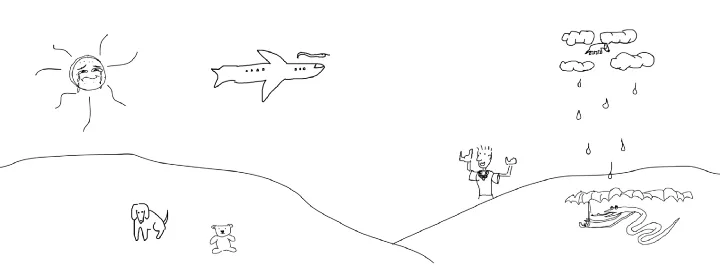
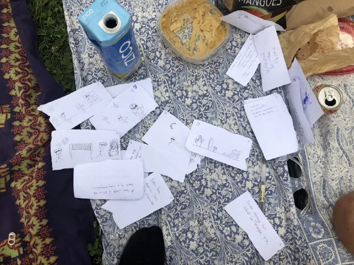
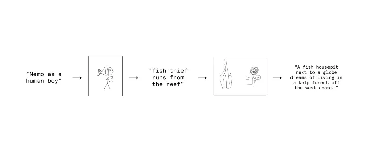
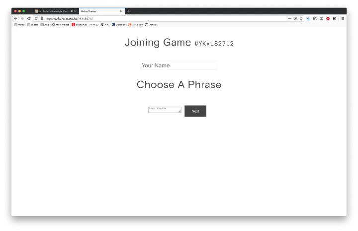
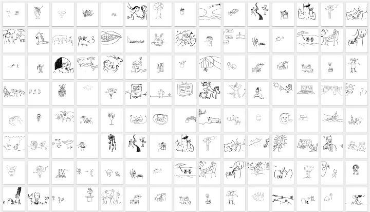
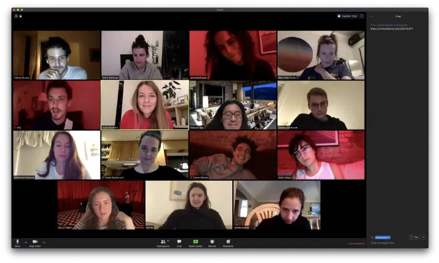
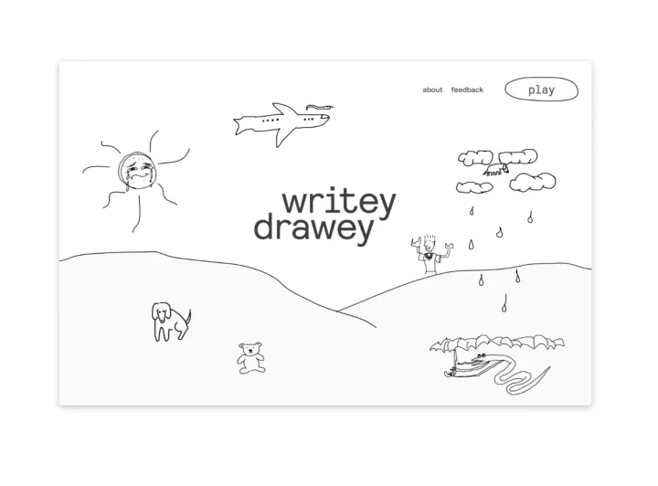

<figure>
  
</figure>

## The game that almost died during COVID and how I made it an app
A reflection on 1 year of writeydrawey
Back before the pandemic, my friends and I used to love playing a nameless pen-and-paper game that was like a cross between telephone and pictionary. A common activity in parks or group dinners, it reliably made us laugh and could easily be taught to newcomers.

<figure>
  
  <figcaption>Playing “the game” IRL</figcaption>
</figure>

The game works like this: everybody gets a small stack of paper and writes down a random sentence. They pass their stack to the person sitting to their right who makes a drawing to illustrate the phrase and gives their papers to the next player. That person comes up with a phrase to describe the drawing; the pattern continues — writing then drawing then writing — until a full loop is made and everyone gets back the stack with their original phrase on it.

> Want to read this story later? [Save it in Journal.](https://heyday.xyz/?utm_source=medium.com&utm_medium=noteworthy_blog&utm_campaign=tech&utm_content=guest_post_read_later_text){:target="_blank" rel="noopener noreferer"}

The best part is at the end when everybody shares and we flip through the pages, watching a chain of misunderstandings and mistakes unfold. It’s rare when the cards at the end of the game resemble the ones at the beginning; the creative subconscious tends to take over and forms something completely new.

<figure>
  
  <figcaption>You never know what you’re gonna get</figcaption>
</figure>

### Covid Days
In those first blurry weeks of lockdown, giddy confusion eventually gave way to melancholy. To stay connected, a group of friends and I set up weekly zoom meetings. With some people cooking or working, others leaving the screen on mute while they cooked or did chores, it was the beginning of a new era of screen-based socializing. “We should play the game” somebody said. “We can use our webcams to hold up our drawings”. But it didn’t work; we needed some way to pass information to each other in secret, like little stacks of paper.

At the time my job was in hyper-bureaucracy mode; our product team was slowed to a halt by the game of thrones happening in C-Suite. It was one of those situations where the amount of time we spent getting things “right” could have easily just gone into making forward progress.

I thought building a version of the game might be a good creative outlet. Unlike the situation at work, I could build quickly and on my own, and it would be fun to share with my friends and coworkers who were all stuck on screens. Not to mention covid lockdowns had removed most other forms of entertainment (and distraction).

After back-to-back weekends spent coding, I finished a basic version of the game and sent the link to my friends on our next zoom call. I played a round with my coworkers during our Friday standup. Somebody called it Writey Drawey and the name stuck. here’s what it looked like:

<figure>
  
  <figcaption>You never know what you’re gonna get</figcaption>
</figure>

It was rough around the edges, but proved good enough to spread organically through friends for the next few months. People started playing weekly with their families, across a handful of languages and countries, and even drafting t-shirt designs with the drawings they loved.

### Everybody can draw
When people hear about the game, a common hesitation comes from a discomfort around drawing and art-making. “A drawing game? But I don’t know how to draw.” Yet nobody seemed to have that response when using pieces of scrap paper in a park.

Is there something intimidating about the internet? Are we conditioned to expect that our contribution will be scrutinized, measured, and compared if we post it?

Yet those same people often end up making some of the most interesting drawings filled with originality and character. It’s an example of how imperfection and vulnerability can be the most interesting parts of creative endeavors. Most children love drawing yet at some point grow up to fear it, spending their adult lives avoiding pen and paper. Yet when they do draw, the work is usually awesome and hilarious in its own right.

<figure>
  
  <figcaption>Some favorites among the thousands of images made on Writey Drawey</figcaption>
</figure>

### Speaking through screens
Writey Drawey might not have existed without the digital shift we’ve made over the last year. I probably would have no reason to build such a thing given the abundance of pens, paper, and parks in most cities. And yet it hasn’t been easy adapting to digital space. Since most of our experiences online are built for efficiency, clarity, and predictability, there’s limited bandwidth left for human connection. It’s fascinating to me that I found a lot more connection through a game which deliberately obscures and distorts the meaning of what you put into it. What does that say about the nature of digital community? Is it possible that we’ve been trying too hard all this time?

<figure>
  
</figure>

### Writey Drawey 2.0
Today, I’m announcing an updated version of Writey Drawey that’s more polished and approachable than its predecessors. The homepage is illustrated with some of my favorite in-game drawings selected anonymously from the thousands created over the last year. I’ve also added a gallery showcasing every artwork made on the platform, and a public game mode which allows you to play with strangers.

I hope everyone continues to use and enjoy Writey Drawey to the same degree I have over the past year. I hope new audiences find this website and get some laughs out of it. So gather a crew of friends, family or colleagues for a game and see if what happens surprises you.

Visit the site: <https://writeydrawey.site>

View the gallery: <https://writeydrawey.site/gallery>

<figure>
  
</figure>

@coltontbrown

